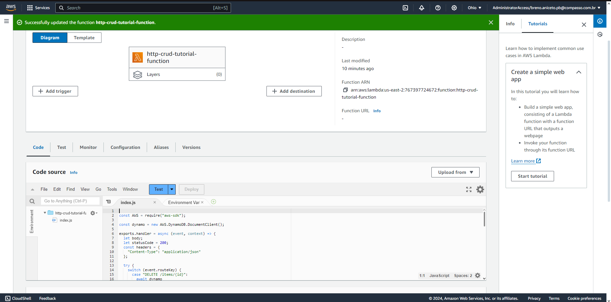
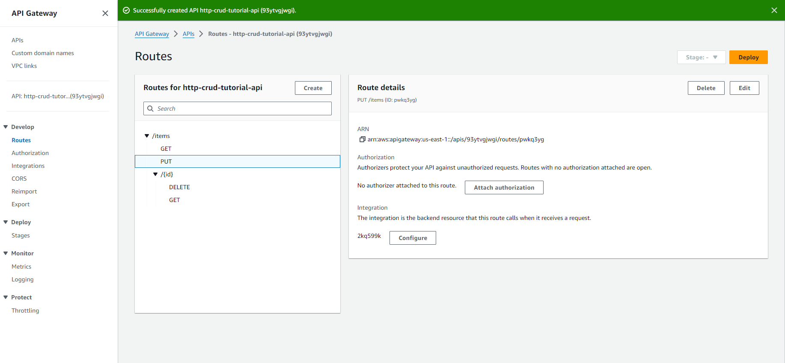
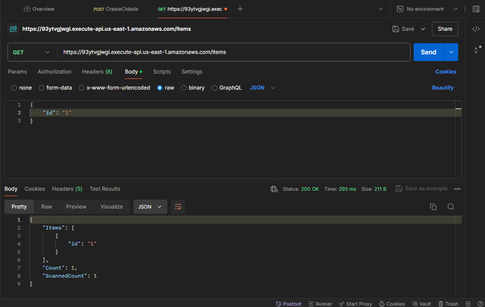

# Build Your First CRUD API in 45 Minutes or Less!

## Introdução

Neste tutorial, aprendi a criar uma API CRUD (Create, Read, Update, Delete) em menos de 45 minutos utilizando ferramentas e serviços da AWS.

## Ferramentas Utilizadas

### 1. **AWS Lambda**
AWS Lambda é um serviço de computação serverless que permite executar código sem provisionar ou gerenciar servidores. Utilizamos Lambda para hospedar as funções de nossa API.

### 2. **Amazon API Gateway**
Amazon API Gateway facilita a criação, publicação, manutenção, monitoramento e segurança de APIs em qualquer escala. É usado para gerenciar as solicitações HTTP e encaminhá-las para nossas funções Lambda.

### 3. **Amazon DynamoDB**
Amazon DynamoDB é um banco de dados NoSQL gerenciado e rápido. Utilizamos DynamoDB para armazenar e recuperar dados para nossa API.

## Pontos de Aprendizado

### 1. **Criar Funções Lambda**
Criei uma função Lambda para as operações CRUD (Create, Read, Update, Delete).

### 2. **Configurar o API Gateway**
Configurei o API Gateway para roteamento das solicitações HTTP para as funções Lambda.

### 3. **Configurar o DynamoDB**
Criei uma tabela no DynamoDB para armazenar os dados da API.

### 4. **Testar a API**
Testei a API utilizando o Postman para verificar que todas as operações do CRUD estavam funcionando

## Conclusão

Construir uma API CRUD usando serviços da AWS é uma excelente maneira de aprender sobre computação serverless, gerenciamento de APIs e bancos de dados NoSQL.