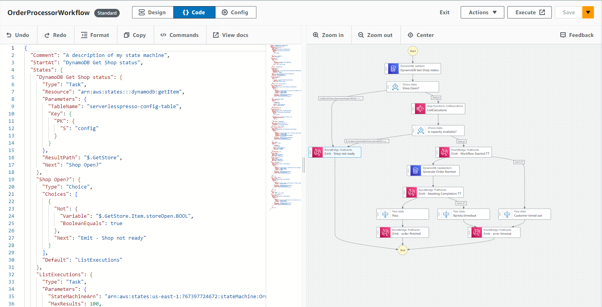
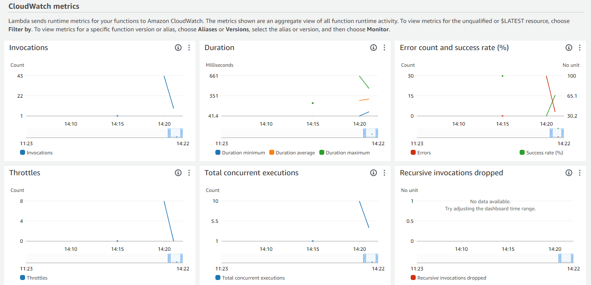
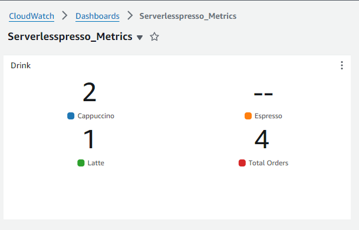
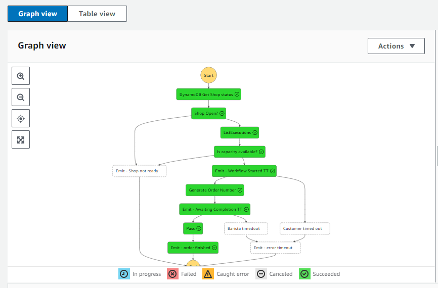
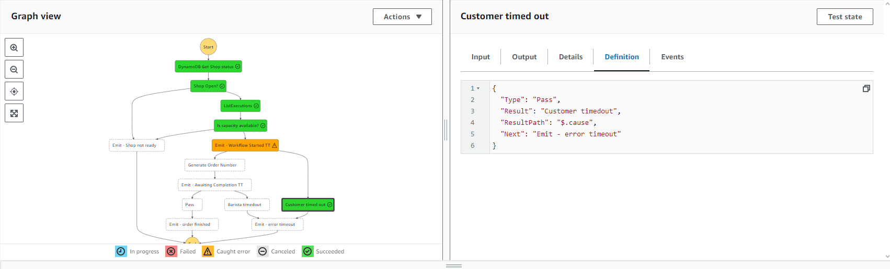
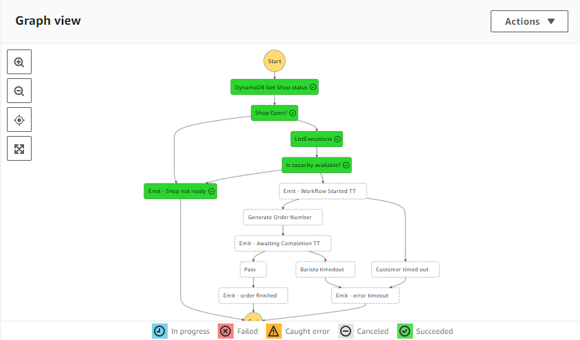
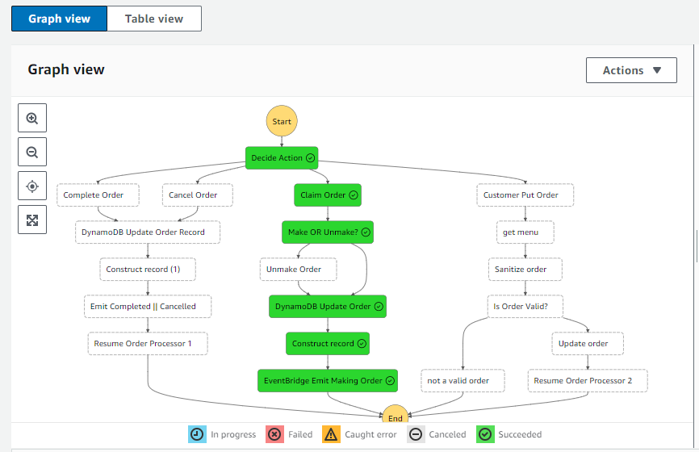
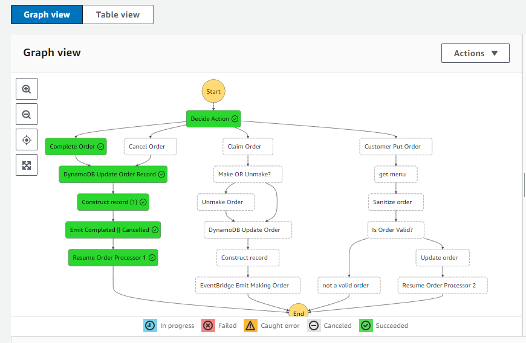
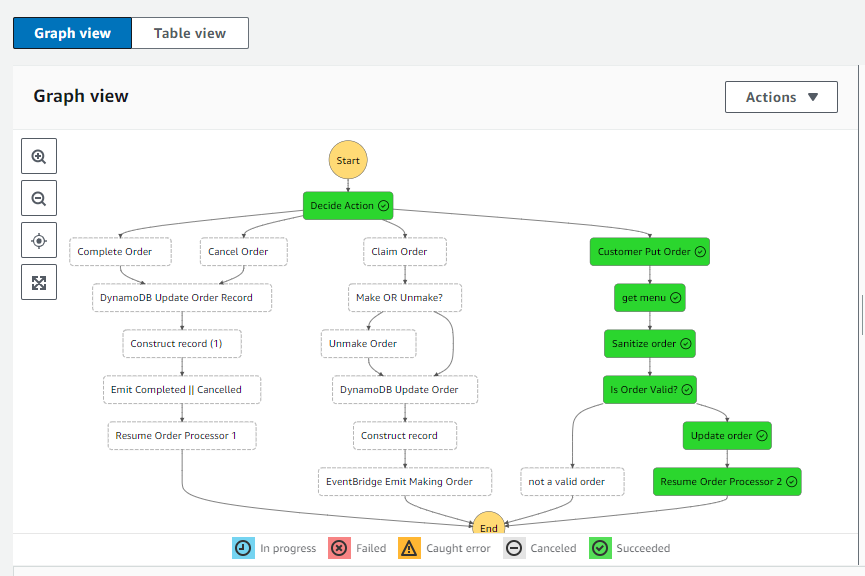

# Serverless Espresso Workshop

## Introdução

Neste workshop, aprendi a criar uma aplicação serverless para pedidos de café utilizando ferramentas e serviços da AWS.
## Ferramentas Utilizadas

### 1. **AWS Lambda**
### 2. **Amazon API Gateway**
### 3. **Amazon DynamoDB**
### 4. **AWS Step Functions**
AWS Step Functions facilita a coordenação dos componentes de aplicações distribuídas e microserviços utilizando fluxos de trabalho visuais. Utilizamos Step Functions para orquestrar o processamento dos pedidos.

### 5. **AWS IAM (Identity and Access Management)**
AWS IAM é usado para gerenciar permissões e acesso aos serviços da AWS de forma segura. Configuramos políticas e funções para garantir que apenas serviços autorizados possam interagir com nossos recursos.

### 6. Amazon SQS (Simple Queue Service)
Amazon SQS é um serviço de enfileiramento de mensagens totalmente gerenciado que permite desacoplar e escalar microsserviços, sistemas distribuídos e aplicações sem servidor. Utilizamos SQS para garantir que os pedidos de café sejam processados de maneira confiável e escalável.

### 6. Amazon CloudWatch
Amazon CloudWatch é um serviço de monitoramento e observabilidade que fornece dados e insights acionáveis para monitorar suas aplicações, responder a mudanças no desempenho do sistema e otimizar a utilização de recursos. Utilizamos o CloudWatch para monitorar o desempenho da aplicação e criar dashboards personalizados.

## Pontos de Aprendizado

### 1. **Configurar o DynamoDB**
Criei uma tabela no DynamoDB para armazenar os dados dos pedidos de café, incluindo informações como ID do pedido, tipo de café, status do pedido, e horário de criação.

### 4. **Orquestrar com Step Functions**
Utilizei Step Functions para criar um fluxo de trabalho que orquestra o processamento dos pedidos de café, garantindo que cada etapa do processo seja executada na ordem correta.

### 5. Desacoplar com SQS
Roteei todos os eventos de pedidos concluídos do fluxo de trabalho OrderManager para uma fila SQS. Uma função Lambda processa os eventos em lotes da fila e atualiza a tabela de métricas, facilitando a coleta de métricas de negócios e reduzindo a pressão sobre os sistemas downstream de picos de tráfego no barramento de eventos.

### 6. Monitorar com CloudWatch
Monitorei métricas chave, como tempo de execução das funções Lambda, número de mensagens na fila SQS e performance geral da aplicação. Isso facilita a identificação e resolução de problemas em tempo real.

### 7. **Testar a Aplicação**
Além de testar a aplicação executando as Step Functions foi possível também testar a partir do frontend da aplicação e simular pedidos reais 

## Conclusão

Construir uma aplicação serverless usando serviços da AWS é uma excelente maneira de aprender sobre computação serverless, gerenciamento de APIs, bancos de dados NoSQL e orquestração de fluxos de trabalho.